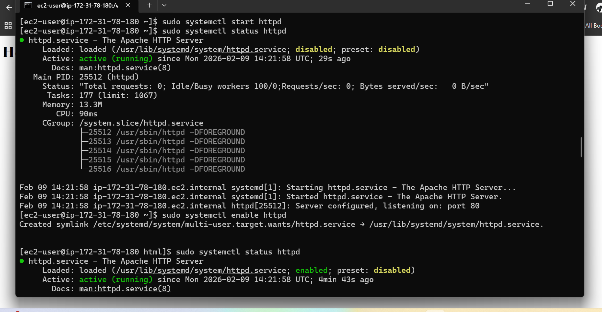
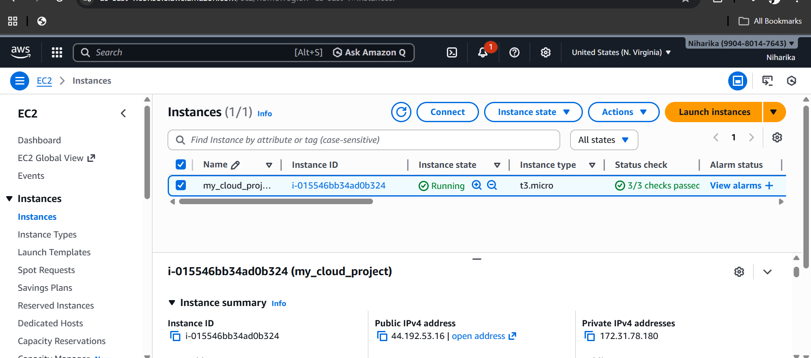
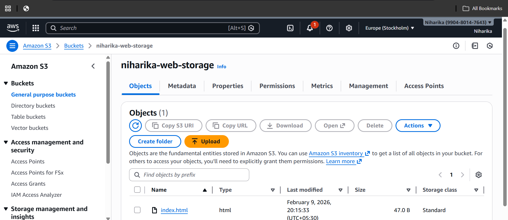
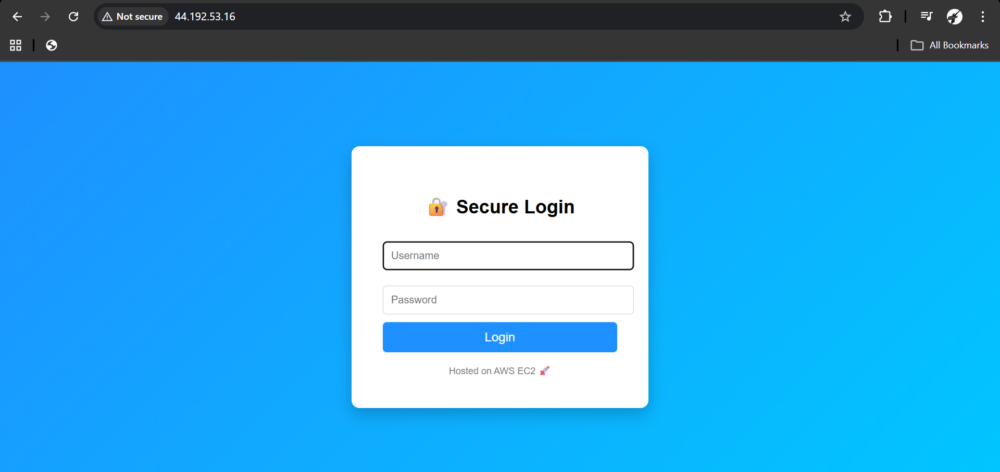

# 🚀 AWS Secure Web Application Deployment

## 📌 Project Overview
Deployed a secure and scalable web application on AWS Cloud using EC2, S3, IAM, and CloudWatch.  
Configured Linux server, Apache web server, monitoring, and alerting to ensure high availability and performance.

This project demonstrates real-world **Cloud Support / DevOps / AWS Administrator skills**.

---

## 🛠️ Tech Stack
- Amazon EC2 (Linux Server)
- Apache HTTP Server
- Amazon S3 (Storage)
- IAM Roles & Policies
- Amazon CloudWatch (Monitoring & Alerts)
- AWS CLI
- Linux (Amazon Linux 2023)
- Git & GitHub

---

## 🏗️ Architecture
User → EC2 (Apache Web Server) → S3 Storage  
CloudWatch monitors EC2 performance and triggers alerts.

---

## ⚙️ Implementation Steps

### 1️ Launch EC2 Instance
- Created Amazon Linux EC2 instance
- Configured security group (HTTP + SSH)
- Connected using SSH

ssh -i key.pem ec2-user@PUBLIC_IP

### 2 Install Apache Web Server
sudo yum install httpd -y
sudo systemctl start httpd
sudo systemctl enable httpd

### 3️ Deploy Web Page
cd /var/www/html
sudo nano index.html
Created login page and hosted it publicly.

### 4️ Create S3 Storage Bucket
aws s3 mb s3://niharika-web-storage
aws s3 cp index.html s3://niharika-web-storage/
Used for storing static files.

### 5️ Configure CloudWatch Monitoring

Monitored CPU utilization
Created alarms for high CPU usageSet threshold alerts
Alarm Example:
CPU > 70%
1 minute interval

### 6️ Stress Test Monitoring
yes > /dev/null &
yes > /dev/null &
yes > /dev/null &
yes > /dev/null &

### 7 To stop stress test
killall yes

### Server commands

### EC2 Instance Running

### CloudWatch Alarm
.png)

### S3 Storage

### Web app running

